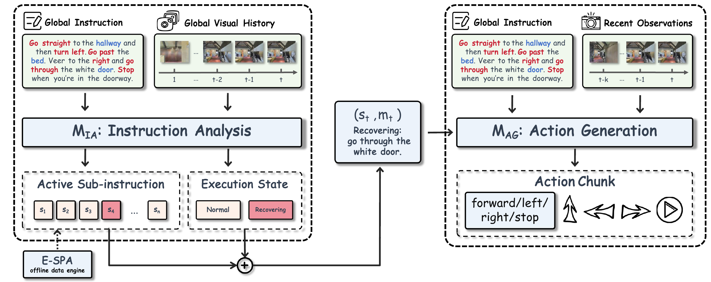

<br>
<p align="center">
<h1 align="center"><strong>From Routes to Steps: Separating Semantic Progress from Local Execution in Vision-and-Language Navigation</strong></h1>
  <p align="center">
    <strong>
    Xiangyun Huang<sup>1</sup>&emsp;
    Xiangchen Wang<sup>2</sup>&emsp;
    Runfeng Lin<sup>1,3</sup>&emsp;
    Yihao Xu<sup>1</sup>
    <br>
    Kangyu Huang<sup>4</sup>&emsp;
    Jiang Hengchen<sup>1,5</sup>&emsp;
    Xiwang Dong<sup>1</sup>&emsp;
    Lin Jiarong<sup>1,*</sup>
    </strong>
    <br>
    <sup>1</sup>Beihang University&emsp;
    <sup>2</sup>Southern University of Science and Technology&emsp;
    <sup>3</sup>Central South University&emsp;
    <br>
    <sup>4</sup>Harbin Institute of Technology, Shenzhen&emsp;
    <sup>5</sup>Dalian University of Technology
    <br>
    <code>23231088@buaa.edu.cn, zivlin@buaa.edu.cn</code>
  </p>
</p>

<!-- TODO: add the Bilibili link when available. -->
<p id="top" align="center">
  <a href="https://arxiv.org/abs/2608.03143"></a>
  <a href="https://sisyphus-hxy.github.io/Route2Step/"></a>
  <a href="https://huggingface.co/XiangyunHuang/Route2Step"></a>
  <a href="https://www.youtube.com/watch?v=vBUAny2WqM0"></a>
  
</p>

## 🏠 About

This repository contains the official implementation of **Route2Step**, a
vision-and-language navigation framework that separates semantic progress
tracking from local action execution through an explicit step-level interface.

<p align="center">
  
</p>

## Release Status

| Component | Status |
|---|---|
| Code | ✅ Available |
| MIA and MAG checkpoints | ✅ Available |
| Processed supervision data | Not released |

## 🛠 Getting Started

We test under Python 3.10 with Habitat-Sim and Habitat-Lab v0.2.4.

1. **Create the environment**

```bash
conda create -n route2step_py310 python=3.10 -y
conda activate route2step_py310
pip install -r requirements_eval.txt
```

2. **Install Habitat v0.2.4**

Run from the Route2Step repository root. Both repositories will be placed
under `Route2Step/`.

```bash
git clone --branch v0.2.4 --recursive https://github.com/facebookresearch/habitat-sim.git
cd habitat-sim
python setup.py install --headless --with-cuda --bullet
cd ..
git clone --branch v0.2.4 https://github.com/facebookresearch/habitat-lab.git
pip install -e habitat-lab/habitat-lab
```

## External data and models

Datasets and Matterport3D assets are not bundled. Download the model repository
and place its `MIA/` and `MAG/` directories under `model_zoo/`.

The Route2Step model weights are available in the single Hugging Face
repository [`XiangyunHuang/Route2Step`](https://huggingface.co/XiangyunHuang/Route2Step),
under the `MIA/` and `MAG/` subdirectories.

### Expected data layout

```text
Route2Step/
├── data/
│   ├── scene_datasets/
│   │   └── mp3d/
│   └── datasets/
│       ├── R2R_VLNCE_v1-3/
│       └── rxr/
├── model_zoo/
│   ├── MIA/
│   └── MAG/
└── eval/
```

## Evaluation

Run commands from the repository root and activate the environment in each new
terminal:

```bash
conda activate route2step_py310
```

<!--
### Static M1 evaluation

Start a vLLM server at `http://127.0.0.1:8086`, then run:

```bash
TASK_TYPE=single_m1 \
DATASET=rxr_deviation \
RESULT_DIR=eval_results/m1/rxr_deviation \
bash scripts/eval_m1_static_qa.sh
```

Supported `TASK_TYPE` values are `single_m1` and `m1_subinstruction`. Supported
`DATASET` values are `r2r`, `r2r_deviation`, `rxr`, and `rxr_deviation`.
-->

### vLLM servers

Transformers local loading is enabled by default. For faster evaluation, vLLM
can be installed in the evaluation environment or a separate environment:

```bash
pip install vllm
```

Start MIA and MAG in two terminals:

```bash
CUDA_VISIBLE_DEVICES=0 vllm serve model_zoo/MIA --served-model-name m1 --port 8081 --max-model-len 10240 --trust-remote-code
CUDA_VISIBLE_DEVICES=1 vllm serve model_zoo/MAG --served-model-name m2 --port 8080 --max-model-len 8192 --trust-remote-code
```

Set `USE_VLLM=true` when launching an evaluation script to use these servers.

### Navigation evaluation

Both scripts load `model_zoo/MIA` and `model_zoo/MAG` locally by default:

```bash
# R2R-CE
bash scripts/eval_qwen2_5_dual_lm.sh
# RxR-CE
bash scripts/eval_qwen2_5_dual_rxr.sh
```

Use the servers above for faster evaluation:

```bash
USE_VLLM=true bash scripts/eval_qwen2_5_dual_lm.sh
USE_VLLM=true bash scripts/eval_qwen2_5_dual_rxr.sh
```

### Analyze results

```bash
python scripts/analyze.py --result_dir eval/r2r_v1_3
python scripts/analyze.py --result_dir eval/rxr
```

The alignment and data-construction utilities are under `seg/`, `DAgger/`,
and `scripts/`. Use `python <script> --help` to inspect their input paths and
options. Training dependencies and end-to-end training recipes will be
provided in a subsequent release.

## Citation

```bibtex
@misc{huang2026route2step,
  title         = {From Routes to Steps: Separating Semantic Progress from Local Execution in Vision-and-Language Navigation},
  author        = {Xiangyun Huang and Xiangchen Wang and Runfeng Lin and Yihao Xu and Kangyu Huang and Jiang Hengchen and Xiwang Dong and Lin Jiarong},
  year          = {2026},
  eprint        = {2608.03143},
  archivePrefix = {arXiv},
  primaryClass  = {cs.CV},
  url           = {https://arxiv.org/abs/2608.03143}
}
```
