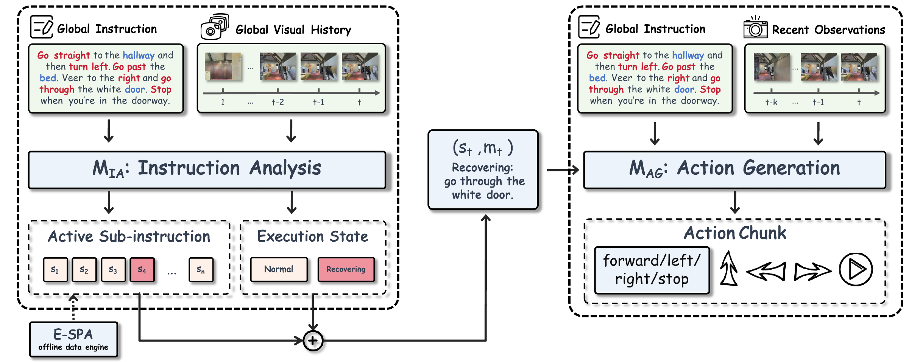

<br>
<p align="center">
<h1 align="center"><strong>From Routes to Steps: Separating Semantic Progress from Local Execution in Vision-and-Language Navigation</strong></h1>
  <p align="center">
    <strong>
    Xiangyun Huang<sup>1</sup>&emsp;
    Xiangchen Wang<sup>2</sup>&emsp;
    Runfeng Lin<sup>1,3</sup>&emsp;
    Yihao Xu<sup>1</sup>
    <br>
    Kangyu Huang<sup>4</sup>&emsp;
    Jiang Hengchen<sup>1,5</sup>&emsp;
    Xiwang Dong<sup>1</sup>&emsp;
    Lin Jiarong<sup>1,*</sup>
    </strong>
    <br>
    <sup>1</sup>Beihang University&emsp;
    <sup>2</sup>Southern University of Science and Technology&emsp;
    <sup>3</sup>Central South University&emsp;
    <br>
    <sup>4</sup>Harbin Institute of Technology, Shenzhen&emsp;
    <sup>5</sup>Dalian University of Technology
  </p>
</p>

<p id="top" align="center">
  <a href="https://arxiv.org/abs/2608.03143"></a>
  <a href="https://buaa-gamma-lab.github.io/Route2Step/"></a>
  <a href="https://huggingface.co/XiangyunHuang/Route2Step"></a>
  <a href="https://www.youtube.com/watch?v=vBUAny2WqM0"></a>
  <a href="https://www.bilibili.com/video/BV15SMX6FEG8/"></a>
</p>

Route2Step is a vision-and-language navigation framework that separates route-level progress tracking from local action execution through an explicit step-level interface.

## 🔎 Overview

Long-horizon navigation failures can come from two different sources: the agent may select the wrong instruction segment, or it may fail to execute the correct segment. Route2Step keeps these decisions separate with two cooperating agents:

- **MIA** tracks progress through the global instruction and selects the current sub-instruction.
- **MAG** converts the current sub-instruction and visual observations into local actions.

The public release focuses on evaluation, model checkpoints, and a Unitree GO2 deployment path.

<p align="center">
  
</p>

## 📦 Release status

| Component | Status |
| --- | --- |
| Evaluation code | ✅ Released |
| MIA and MAG checkpoints | ✅ Released |
| Unitree GO2 deployment code | ✅ Released |
| Processed supervision data | 🧭 Coming soon |
| End-to-end training recipes | 🧭 Planned |

## 🛠️ Installation

### 1. Create the environment

The released evaluation setup uses Python 3.10.

```bash
conda create -n route2step_py310 python=3.10 -y
conda activate route2step_py310
pip install -r requirements_eval.txt
```

### 2. Install Habitat

Install Habitat-Sim and Habitat-Lab v0.2.4 from their upstream repositories:

```bash
git clone --branch v0.2.4 --recursive https://github.com/facebookresearch/habitat-sim.git
cd habitat-sim
python setup.py install --headless --with-cuda --bullet
cd ..

git clone --branch v0.2.4 https://github.com/facebookresearch/habitat-lab.git
pip install -e habitat-lab/habitat-lab
```

### 3. Download models and data

Datasets and Matterport3D assets are not bundled with this repository. Download the required assets separately and place them under `data/`.

The MIA and MAG checkpoints are available from the [Route2Step model repository](https://huggingface.co/XiangyunHuang/Route2Step). Place the two model directories at:

```text
model_zoo/
├── MIA/
└── MAG/
```

## 🧭 Evaluation

Run commands from the repository root after activating the environment.

### Local model loading

```bash
# R2R-CE
bash scripts/eval_qwen2_5_dual_lm.sh

# RxR-CE
bash scripts/eval_qwen2_5_dual_rxr.sh
```

### vLLM serving

For faster evaluation, start one OpenAI-compatible vLLM server for each model, then set `USE_VLLM=true`:

```bash
CUDA_VISIBLE_DEVICES=0 vllm serve model_zoo/MIA \
  --served-model-name m1 --port 8081 --max-model-len 10240 --trust-remote-code

CUDA_VISIBLE_DEVICES=1 vllm serve model_zoo/MAG \
  --served-model-name m2 --port 8080 --max-model-len 8192 --trust-remote-code
```

```bash
USE_VLLM=true bash scripts/eval_qwen2_5_dual_lm.sh
USE_VLLM=true bash scripts/eval_qwen2_5_dual_rxr.sh
```

## 🤖 Real-world deployment

The `realworld/` directory contains a remote inference server and a ROS2 client for Unitree GO2.

```bash
pip install -r realworld/requirements.txt
python realworld/server.py --host BIND_HOST --port 5801
```

On the GO2 side, pass the server endpoint explicitly:

```bash
python realworld/go2_vln_client.py \
  --server-url http://SERVER_HOST:5801/eval_vln \
  --instruction "Walk forward and stop when you exit the room." \
  --session-id go2-001
```

`BIND_HOST` and `SERVER_HOST` are runtime placeholders. Keep deployment addresses and robot logs out of commits. See [`realworld/GO2_DEPLOY.md`](realworld/GO2_DEPLOY.md) for ROS2, Unitree, topic, and troubleshooting details.

## 🗂️ Repository structure

| Directory | Purpose |
| --- | --- |
| `DAgger/` | Data construction and DAgger utilities |
| `habitat_vln/` | Habitat-based navigation evaluation |
| `scripts/` | Evaluation and analysis entry points |
| `seg/` | Instruction segmentation and alignment tools |
| `realworld/` | Unitree GO2 deployment code |

## ⚠️ Notes

- Matterport3D data and other licensed assets must be obtained from their respective sources.
- The real-world client requires a ROS2 installation and the Unitree message packages on the robot side.
- Training dependencies and complete training recipes will be released separately.

## 📚 Citation

```bibtex
@misc{huang2026route2step,
  title         = {From Routes to Steps: Separating Semantic Progress from Local Execution in Vision-and-Language Navigation},
  author        = {Xiangyun Huang and Xiangchen Wang and Runfeng Lin and Yihao Xu and Kangyu Huang and Jiang Hengchen and Xiwang Dong and Lin Jiarong},
  year          = {2026},
  eprint        = {2608.03143},
  archivePrefix = {arXiv},
  primaryClass  = {cs.CV},
  url           = {https://arxiv.org/abs/2608.03143}
}
```
